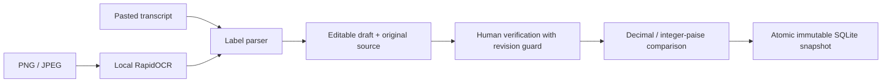
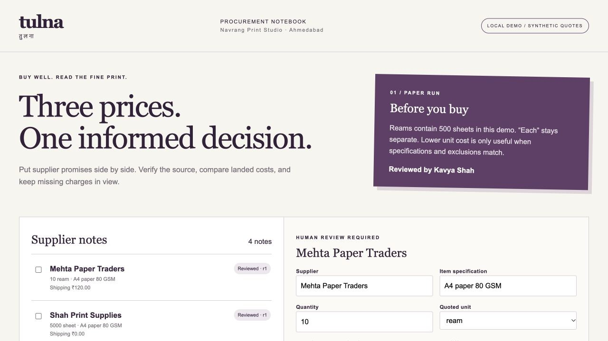
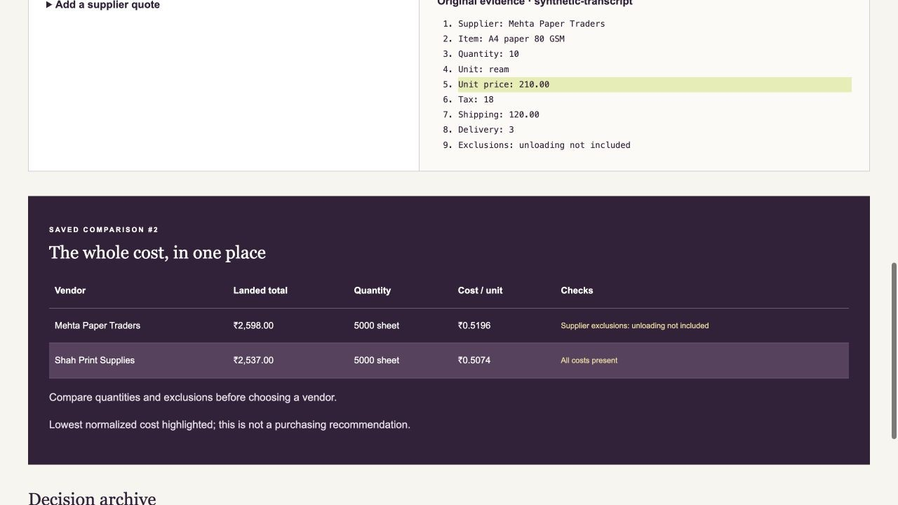
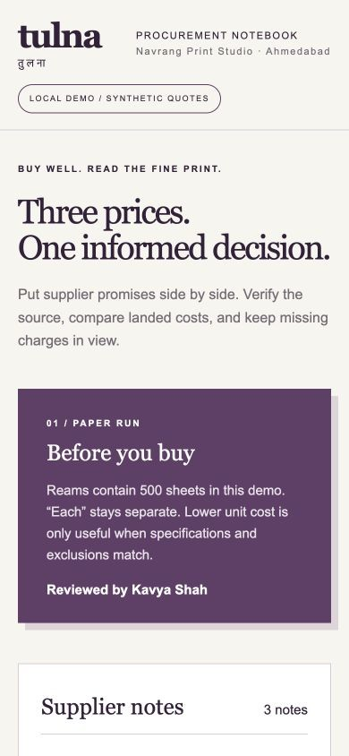
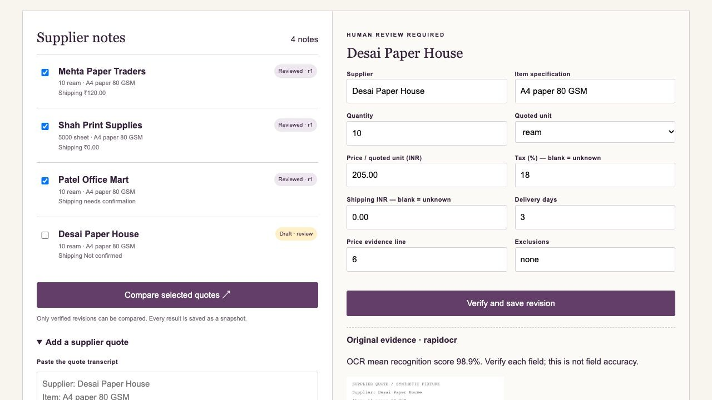

# Tulna — Vendor Quote Comparison

A procurement notebook for a fictional Ahmedabad print agency: compare paper suppliers while keeping tax, shipping, quantities and exclusions visible. **Local learned OCR reads images; explicit parsing rules and exact arithmetic compare human-reviewed fields.** There is no LLM and no fabricated vendor information.

**Python · Flask · SQLite · RapidOCR / ONNX Runtime · vanilla JavaScript**

Clone commands below use this project's public repository URL. If you already have this folder locally, skip `git clone` and `cd`.

## Setup independently

This folder is a standalone repository. It does not import code or packages from sibling projects. Use **Python 3.10–3.12**; Python 3.13+ is outside the pinned OCR/numerical dependency scope. Dependencies install from PyPI; inference and app workflows then run locally without API keys. macOS/Linux and Windows commands below are installation instructions; the recorded local run used macOS and Python 3.12.14.

macOS / Linux:

```sh
git clone https://github.com/Siddh-sys-rgb/tulna-vendor-quote-comparison.git
cd tulna-vendor-quote-comparison
python3 -m venv .venv
source .venv/bin/activate
python -m pip install -r requirements-dev.txt
python app.py --port 8110
```

Windows PowerShell:

```powershell
git clone https://github.com/Siddh-sys-rgb/tulna-vendor-quote-comparison.git
cd tulna-vendor-quote-comparison
py -3.12 -m venv .venv
.\.venv\Scripts\Activate.ps1
python -m pip install -r requirements-dev.txt
python app.py --port 8110
```

If activation is blocked by your local PowerShell policy, use `.\.venv\Scripts\python.exe` directly for the last two commands. Keep the terminal running and stop with Ctrl+C. The server binds to `127.0.0.1` with debug disabled. This is a local demonstration, not a hosted production service.

Data is persisted under ignored `data-local/`. Use `python app.py --data-dir /path/to/another-folder --port 8110` for an isolated workspace. `--no-demo` skips seeding an empty database; it does not delete existing data. Each app has its own cookie name, database and local signing key. Do not share your data folder or its `.session-key`.

Open **http://127.0.0.1:8110**.

## Demo walkthrough

1. Review the three original fictional supplier notes for **Navrang Print Studio**, with Kavya Shah as the demo reviewer. Read the numbered source lines beside each editable quote.
2. Select all three and compare. Patel Office Mart has no shipping amount, so its landed total stays unknown and the app refuses to rank the offers.
3. Open Patel's note, enter an illustrative shipping cost, and click **Verify and save revision**. Its source transcript stays unchanged; the form records your human verification of the edited fields.
4. Compare again. Reams normalize to 500 sheets. A “sheet” quote can be compared to a “ream” quote when the item text matches; “each” remains a separate unit family.
5. Paste a new quote using the labelled format below. Missing fields remain blank; the app requires valid human input before comparing.
6. Upload `demo/synthetic-quote.png`. RapidOCR reads this real authored image on the CPU; review its extracted fields and original image before verification. The first upload loads bundled models and may take several seconds.
7. Reopen a previous comparison from the decision archive. Later quote edits do not rewrite that snapshot.

```text
Supplier: Desai Paper House
Item: A4 paper 80 GSM
Quantity: 10
Unit: ream
Unit price: 205.00
Tax: 18
Shipping: 0.00
Delivery: 3
Exclusions: unloading not included
```

The exact label format is the bounded parser contract. Arbitrary supplier tables, handwriting and multilingual documents may need manual transcription. The parser does not guess missing names, quantities, units or prices. OCR recognition scores describe text recognition, **not field accuracy**.

## Scope and purchasing assumptions

- One item specification per supplier quote. A quote's quantity and price refer to its quoted unit; reams contain 500 sheets in this demo.
- All prices are INR. Inputs allow at most two decimal places. Subtotals, tax and shipping use integer paise; tax rounds once using Decimal half-up. Normalized unit costs display four decimal places; ranking compares the exact unrounded total-per-unit ratios.
- `Tax: 0` and `Shipping: 0.00` mean explicitly confirmed zero; a blank means unknown. Unknown tax or shipping prevents a landed total and overall ranking.
- Tax is calculated on the goods subtotal. Shipping is added after that tax. Real invoice/tax rules can differ; percentages in fixtures are illustrative.
- Exact case-insensitive item-text agreement is required for ranking. No product synonym matching or hidden specification inference is performed.
- Different normalized quantities trigger a volume-tier warning even when unit costs can be compared. Exclusions and delivery days remain human decision factors. A lowest-cost highlight is not a purchasing recommendation.
- Human verification records a reviewed revision; it does not prove supplier authenticity. Local demo samples are clearly labelled synthetic transcripts, not OCR output.

## Architecture and saved evidence



`domain.py` owns validation, parsing and arithmetic. `app.py` owns uploads, security, SQLite transactions and API routes. `templates/` and `static/` are the complete frontend. SQLite quotes hold original source text, optional generated image filename, reviewed fields, verification state and revision. Comparisons store the full reviewed quote revisions and result as an immutable JSON document.

Writes require a signed local session plus `X-CSRF-Token`. The API rejects cross-origin writes and untrusted hosts. Text is inserted with `textContent`, not HTML interpolation. Uploads are restricted to decoded PNG/JPEG data, 5 MB, at least 40 pixels per dimension and at most 12 million pixels. Images are re-encoded under random generated filenames; requests cannot supply filesystem paths. Every quote update and comparison uses `BEGIN IMMEDIATE` to check revisions and commit atomically.

## API

Start with `GET /api/session`; retain its cookie and copy `csrf_token` into the `X-CSRF-Token` header for writes.

| Method | Endpoint | Purpose |
|---|---|---|
| GET | `/api/health` | Runtime identity / model description |
| GET | `/api/session` | Session and CSRF token |
| GET | `/api/quotes` | Original evidence, drafts and revisions |
| POST | `/api/quotes` | JSON `{text: ...}` or multipart `file` PNG/JPEG |
| PUT | `/api/quotes/<id>` | Verify fields with current `revision` |
| POST | `/api/comparisons` | Snapshot `{quotes: [{id, revision}, ...]}` |
| GET | `/api/comparisons` | Latest 25 saved comparisons |
| GET | `/uploads/<generated-name>` | The original uploaded image, re-encoded safely |

`PUT` expects `supplier`, `item`, `quantity`, `unit`, `unit_price`, `tax_percent`, `shipping`, `delivery_days`, `exclusions`, `evidence_line` and `revision`. Select 2–8 unique reviewed quote IDs. Invalid fields return 400, missing objects 404, stale revisions 409, invalid CSRF/origin 403, oversized requests 413 and busy databases 503. Optional fields may be blank; supplier, item, quantity, unit, unit price and an existing evidence line are required for verification.

## Verification

```sh
python -m pytest -q --cov=app --cov=domain --cov=fixtures --cov-report=term-missing
python -m pip check
node --check static/app.js
```

Recorded local result: **69 passed**, **98.68% statement coverage**. This includes an actual RapidOCR inference and image-upload acceptance check using `demo/synthetic-quote.png`. That clean authored fixture is **not a real-world OCR benchmark**. The domain has complete statement coverage in this run; total coverage excludes no source lines and includes the CLI entry point. Meaningful checks cover unknown charges, no invented missing price, incomparable units, quantity-tier warnings, monetary rounding, invalid field types, stale edits, immutable snapshots, two competing updates, image validation, CSRF and literal markup.

`constraints-tested.txt` records the exact local environment for reproducibility; it is not imposed on other platforms. The workflow tests Python 3.10 and 3.12 on Linux after publication. Those remote runs are not claimed as already successful by this README.

## Screenshots









Real captures from the running local app using fictional records. [Browser verification](docs/BROWSER_CHECKS.md).

## Learning and next steps

Consider multi-line quotes, supplier-specific parser adapters, order-quantity matching, a proper approval identity and import deduplication. For a hosted version, add authentication, HTTPS, a production server and tenant isolation. The current scope is a single local procurement workspace; it intentionally has no purchasing/payment integration.

Original fixtures and source code use the [MIT license](LICENSE). Model/dependency licenses remain their own. Implementation references: [RapidOCR 1.4.4](https://pypi.org/project/rapidocr-onnxruntime/1.4.4/), [Flask upload patterns](https://flask.palletsprojects.com/en/stable/patterns/fileuploads/) and [Python decimal](https://docs.python.org/3/library/decimal.html). No external supplier dataset or paid model service was used.
